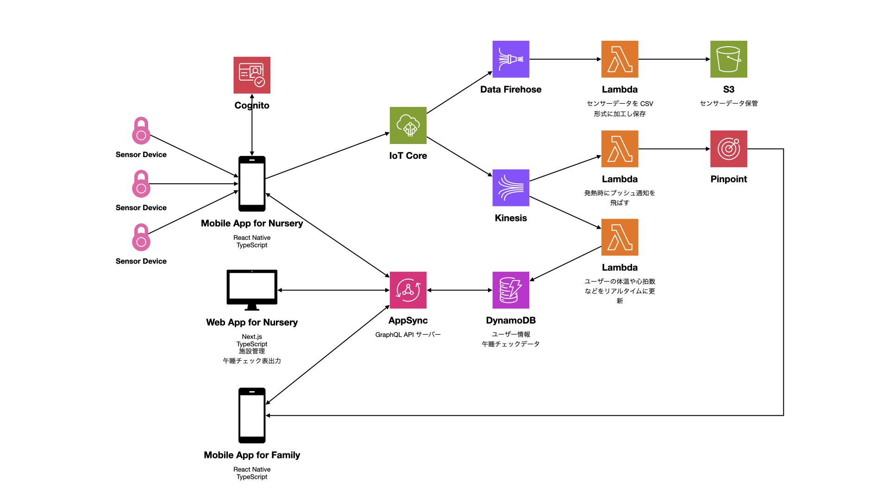

# 数万もの IoT デバイスと月間数十億件のセンサーデータを捌く IoT システムを AWS で構築

## はじめに

こんにちは。 icuco株式会社のハードウェア & ソフトウェアエンジニアの古平です。

IoT システムは現代のさまざまな産業や生活の中で重要な役割を果たしています。本記事では弊社が保育施設向けに提供している「icuco touch＆care」というサービスを例に、数万もの IoT デバイスと月間数十億件のセンサーデータを処理するシステムを AWS 上でどのように構築したかを解説します。技術スタックとしてはフロントエンドとバックエンドの両方で TypeScript を使用し、 AWS の各種サービスをフル活用しています。

## 目次

1. IoT システムの概要
1. 技術スタック
1. アーキテクチャー
1. 実装の詳細
1. ソフトウェアエンジニアを募集中です！

## IoT システムの概要

「icuco touch＆care」は保育施設における子どもたちの体調をセンサーデバイスを使って見守るサービスです。具体的には体動や心拍数、体温などのデータを収集し、保育士が子どもの状態をリアルタイムで確認できるようにします。このシステムは以下の技術スタックとアーキテクチャーに基づいて構築されています。

## 技術スタック

<time>2024</time> 年の現代においては TypeScript + Node.js + React + GraphQL というスタックは日本でもメジャーになりましたが、弊社では <time>2018</time> 年の設計段階からこのスタックを採用しており、技術選定の審美眼的に強みがあると思っています。 <time>2018</time> 年当時はこれらのスタックはグローバルではトレンドにはなっていましたが、日本でこれらのスタックを採用したプロダクトはほとんどなく、よほど Ruby on Rails + Vue の時代でした。

### フロントエンド (ウェブアプリ)

- TypeScript
- React
- Next.js
- GraphQL

### フロントエンド (iOS アプリ)

- TypeScript
- React
- React Native
- RxJS
- GraphQL

### バックエンド

- TypeScript
- Node.js
- GraphQL

### インフラストラクチャー

- AWS Lambda (サーバーレスコンピューティング)
- AWS DynamoDB (NoSQL データベース)
- AWS S3 (オブジェクトストレージ)
- AWS Cognito (認証・認可)
- AWS AppSync (GraphQL API)
- AWS IoT Core (MQTT メッセージブローカー)
- AWS Data Firehose (ストリーミングデータ配信)
- AWS Kinesis (ストリーミングデータ処理)
- AWS Pinpoint (プッシュ通知)

## アーキテクチャー

このシステムのアーキテクチャーはセンサーデバイスから取得したデータがどのように処理され利用者に提供されるかを示しています。

### データの流れ

1. **センサーデバイスからのデータ収集**
    - センサーデバイスは体動、心拍数、体温などのデータを収集し、Bluetooth Low Energy (BLE) 通信により保育所用の iOS アプリケーション (以下「保育所アプリ」) に送信します。

2. **保育所アプリでのデータ処理**
    - 保育所アプリは受信したセンサーデータを元に各幼児の寝姿勢の表示やうつ伏せ寝、無呼吸などの警告を行います。これにより保育士は実際の寝姿勢や体調を確認し対応することができます。
    - 同時に保育所アプリはセンサーデータを MQTT プロトコルで AWS IoT Core に送信します。

3. **データのルーティングと保存**
    - AWS IoT Core はデータを AWS Data Firehose と AWS Kinesis にルーティングします。
    - AWS Data Firehose からは Lambda をトリガーし、センサーデータを CSV 形式に加工して AWS S3 に保存します。
    - AWS Kinesis では 2 つの Lambda をトリガーし、 1 つ目の Lambda はセンサーデータから発熱を検知すると AWS Pinpoint を使って保護者用の iOS アプリケーション (以下「保護者アプリ」) にプッシュ通知を送信します。
    - 2 つ目の Lambda はセンサーデータから体温や心拍数などのデータを抽出し、 DynamoDB をリアルタイムに更新し続けます。このデータは保護者アプリから参照できます。

4. **データの管理と表示**
    - 保育所用ウェブアプリケーション (以下「保育所ウェブアプリ」) は AppSync を経由して DynamoDB に蓄積された幼児の情報を管理し、午睡チェック表の出力を可能にします。

### アーキテクチャー図

以下にシステム全体のアーキテクチャーを示します。

## 実装の詳細

### フロントエンド

#### ウェブアプリケーション

ウェブアプリケーションは React と Next.js を使用して構築されています。 Next.js のサーバーサイドレンダリング機能を活用し、高速な初期表示を実現しています。 GraphQL を使用してバックエンドと通信し、必要なデータを効率的に取得します。

#### iOSアプリケーション

iOS アプリケーションは React Native を使用して開発されています。これにより、クロスプラットフォームの開発が可能となり、保護者アプリと保育所アプリの両方を一つのコードベースで管理できます。 RxJS を使用してリアクティブプログラミングを行い、センサーデータのリアルタイム処理を効率的に実装しています。

### バックエンド

バックエンドは Node.js と GraphQL を使用して構築されています。 GraphQL は柔軟なクエリ機能を提供し、必要なデータのみを効率的に取得できます。 AWS AppSync を使用して GraphQL API を提供し、 DynamoDB と連携します。

### インフラストラクチャー

AWS の各種サービスをフル活用し、スケーラブルで信頼性の高いインフラストラクチャーを構築しています。 AWS Lambda を使用してサーバーレスアーキテクチャを実現し、 AWS IoT Core と連携してセンサーデータを効率的に処理します。 AWS Kinesis と AWS Data Firehose を使用してリアルタイムのデータストリーミングとバッチ処理を行い、 AWS S3 と DynamoDB を使用してデータを安全に保存します。

### インターネット接続が切れても体調監視が続けられるようセミスタンドアロン設計を採用

AWS でのフルクラウド構成によりセンサーデータを低コストかつ効率的に捌けるようになる一方、すべてのセンサーデータ処理をクラウド側でやってしまうとインターネット接続が切れたときにうつ伏せ寝や呼吸停止などの生命に関わる事故を検知できなくなってしまいます。

そこで本システムではクラウドを活用しつつインターネット接続が切れてもローカル端末側で最低限の体調監視を続けられるよう「セミスタンドアロン設計」を採用しました。これはセンサーデバイスから送信されたセンサーデータをローカル端末側で処理し、前述のうつ伏せ寝や呼吸停止などの生命に関わるアラートはローカル端末側で算出するというものです。これにより午睡チェック時の寝姿勢計算もローカル端末側でやることで遅延なく寝姿勢がリアルタイムに検出できるというメリットもあります。

ただし現状では完全なスタンドアロン設計ではなく、寝姿勢の確定操作などはバックエンドの GraphQL API との通信が必要になるため、インターネット接続はやはり必須です。将来的には寝姿勢確定操作などもローカル端末内に一時保存し、後で一括送信するなどの方法でより進化したスタンドアロン設計にすることも計画中です。

## まとめ

本記事では「icuco touch＆care」という保育施設向けの IoT システムを AWS 上で構築する方法を解説しました。センサーデバイスから取得したデータを効率的に処理し、保育士や保護者がリアルタイムで子どもの状態を確認できるようにするためのアーキテクチャーと技術スタックについて詳述しました。このシステムはスケーラブルで信頼性の高いインフラストラクチャーを提供し、今後の IoT システムの構築においても参考になるでしょう。

## ソフトウェアエンジニアを募集中です！

icuco株式会社ではソフトウェアエンジニアを募集中です！

採用ページ
https://www.example.com

もし興味がある方はお気軽に採用担当 [@example](https://x.com/elonmusk) まで DM を送ってください！
