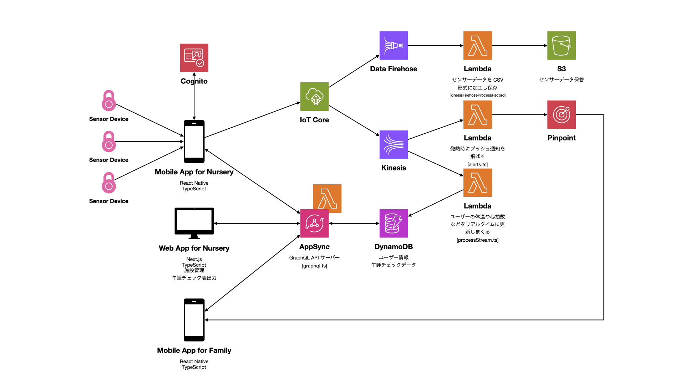
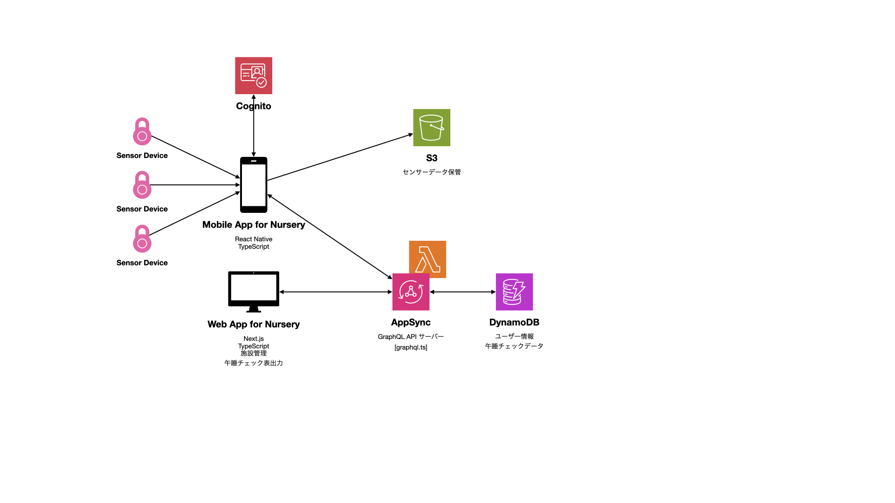

# インフラストラクチャー

## アーキテクチャー図



## 使用している AWS サービスとその役割

ぶっちゃけ言うと以下さえあればシステムは動く。

- AppSync (+ Lambda)
- DynamoDB
- Cognito
- S3

IoT Core 以降の経路は生センサーデータの保存と family app のためのものであり、同 app はすでに廃止済みのため Kinesis 以降の経路は無駄な課金を発生させているだけの遺物に過ぎない。

S3 への生センサーデータ保存は IoT Core を経由させる必要が本当にあるのだろうか？ nursery app から AWS S3 SDK を叩いて直接 S3 に保存すればよい気がする。ただパフォーマンス上の問題が発生したことで IoT Core 経路に変更したというコードコメントが残っている。だとすると S3 に保存するセンサーデータを間引けば (150 マイクロ秒単位ではなく 1 秒単位にするなど) 問題ない可能性がある。

不要な AWS サービスを廃止した場合のアーキテクチャー図は以下のとおり。



### Lambda (サーバーレスコンピューティング)

バックエンドのコードはすべて Lambda で実行している。

EC2 などの仮想マシンではなくプログラム実行環境である Lambda を使用している理由は以下のとおり。

- サーバー管理が不要: コードに注力したい。
- 継続的スケーリング: どんなに利用が殺到しても全自動でスケーリングさせたい。
- 実行時間単位の従量課金: 閑散時間帯の課金を最低限にしたい。

コードのデプロイには
[Serverless Framework](https://www.serverless.com/)
を使用している。
ただ現代では以下のほうがより筋が良いと思われる。

- [AWS Cloud Development Kit (CDK)](https://aws.amazon.com/cdk/)
- [Terraform](https://www.terraform.io/)

### DynamoDB (NoSQL データベース)

生センサーデータログ (S3) と認証情報 (Cognito) 以外のすべてのデータを格納している。

接頭辞が `icuco_dev_` のテーブルは開発環境、 `icuco_prod_` のテーブルは本番環境。

#### テーブル構造

| テーブル名 | 重要度 | 用途 |
| --- | --- | --- |
| baby | ◯ | 園児の個人情報 (氏名、性別、生年月日など) |
| baby_check | ◯ | 午睡チェックデータ (チェック日時、寝姿勢など) |
| baby_daily_status | ◯ | 園児の日次の体調メモ |
| baby_status | △ | センサーデータを元にした園児のリアルタイム体調データ (心拍数、寝てるか起きてるかフラグ、受信信号強度) (family app で使用していたが、同 app はすでに廃止されたため現在は使われていないテーブル) |
| baby_summary | △ | 園児の日次の最終計測体温 (family app で使用していたが、同 app はすでに廃止されたため現在は使われていないテーブル) |
| baby_watch_event | ◯ | 園児が午睡チェック開始状態か終了状態かのフラグ |
| disable_token | ◯ | 退会手続き後の復活機能用認証コード |
| nursery | ◯ | 保育所情報 (名称、法人名、住所、電話番号など) |
| nursery_baby | ◯ | `nursery` テーブルと `baby` テーブルのリレーションテーブル (保育所に所属する園児の紐付け) |
| nursery_sitter | ◯ | `nursery` テーブルと `sitter` テーブルのリレーションテーブル (保育所に所属する保育士の紐付け) |
| plan | × | 不要テーブル (削除しても全く問題なし) (かつて選択制の料金プランを導入する計画があり実装を進めたが計画が廃止になった) |
| room | ◯ | 保育所内に作成するルーム情報および保育所とルームの紐付け (なぜかルームは `nursery_room` リレーションテーブルでの紐付けではない) |
| room_baby | ◯ | `room` テーブルと `baby` テーブルのリレーションテーブル (ルームに所属する園児の紐付け) |
| room_sitter | ◯ | `room` テーブルと `sitter` テーブルのリレーションテーブル (ルームに所属する保育士の紐付け) |
| room_status | ◯ | ルーム環境 (室温、湿度) の日次記録 |
| sensor_pairing_log | ◯ | 園児毎のセンサーデバイス使用ログ (課金に使用) |
| sids_sheet_verified_log | ◯ | 午睡チェック表の管理者確認印の押印データ |
| sitter | ◯ | 保育士の個人情報 (氏名、性別など) |
| sync_available_nursery | × | 不要テーブル (削除しても全く問題なし) (外部サービスとのデータ同期バッチ実装計画があったが廃止) |
| user | △ | 保護者の個人情報 (氏名など) (family app で使用していたが、同 app はすでに廃止されたため現在は使われていないテーブル) |
| user_baby | △ | `user` テーブルと `baby` テーブルのリレーションテーブル (保護者と園児の紐付け) (family app で使用していたが、同 app はすでに廃止されたため現在は使われていないテーブル) |

「重要度」列の凡例
- ◯: システムの稼働に必要
- △: 現在は使われていないので削除可能だと思われるがデータは蓄積され続けている (要検証) (family app で使用していたが、同 app はすでに廃止されたため現在は使われていない)
- ×: まったく使われていなくデータも空ですぐにでも削除可能 (改修計画が凍結されたことによる残骸)

両環境共に特にバックアップは行われていないので AWS コンソールからデータを直接操作する場合は細心の注意が必要。

本システムが設計された 2018 年当時は Lambda から PostgreSQL などの RDBMS を使うのは実質不可能 (水平スケールした Lambda が RDBMS にコネクションを張りまくってプールが枯渇して落ちる) だったため NoSQL データベースである DynamoDB くらいしか選択肢がなかった。

NoSQL データベースなのに RDB のような正規化したテーブル設計になっており、もちろん `JOIN` 句などは使えないのでコード上で力技でテーブル間のリレーションを実現させている。

### S3 (オブジェクトストレージ)

`icuco-sensor-logs` バケットにすべての生センサーデータを CSV 形式で保存。

このデータは現在はただ保存しているだけで手動での調査目的以外で特に使われていない。

### Athena (SQL を使用した S3 でのデータクエリ)

S3 に格納された生センサーデータ (CSV ファイル) に対して SQL で対象データを抽出するために必要 (調査依頼など) に応じて使用。

例えば以下のような SQL 文により対象園児の対象期間のセンサーデータを抽出可能。

```sql
SELECT
  *
FROM
  icucosensorlogs.sensor_logs
WHERE 
  babyid = 'xxxxxxxx-xxxx-xxxx-xxxx-xxxxxxxxxxxx'
  AND
  date BETWEEN date '2024-01-01' AND date '2024-01-31'
;
```

### Cognito (認証・認可)

アプリのログインやバックエンド GraphQL API を叩くときの認証サーバーとして使用。

### AppSync (GraphQL API)

フルマネージドの GraphQL サーバー。リゾルバー (実際のコード) は Lambda で実装されている。

### IoT Core (MQTT メッセージブローカー)

iOS アプリからセンサーデータを送信している。

### Data Firehose (ストリーミングデータ配信)

S3 への生センサーデータ保存のために使用。

### Kinesis (ストリーミングデータ処理)

プッシュ通知用　Lambda と family app 用リアルタイム園児体調情報を表示するために使用していたが同 app はすでに廃止されたため現在は無用の長物。

### Pinpoint (プッシュ通知)

園児が発熱したときに family app にプッシュ通知を飛ばす。が同 app はすでに廃止されたため現在は無用の長物。

## データフロー

### 1. センサーデバイスからのデータ収集

- センサーデバイスは体動、心拍数、体温などのデータを収集し、Bluetooth Low Energy (BLE) 通信により保育所用の iOS アプリケーション (以下「保育所アプリ」) に送信する。

### 2. 保育所アプリでのデータ処理

- 保育所アプリは受信したセンサーデータを元に各幼児の寝姿勢の表示やうつ伏せ寝、無呼吸などの警告を行う。これをもとに保育士は午睡チェックを行い、実際の寝姿勢や体調を記録する。
- 同時に保育所アプリはセンサーデータを MQTT プロトコルで AWS IoT Core に送信する。

### 3. データのルーティングと保存

- AWS IoT Core はデータを AWS Data Firehose と AWS Kinesis にルーティングする。
- AWS Data Firehose からは Lambda をトリガーし、センサーデータを CSV 形式に加工して AWS S3 に保存する。
- AWS Kinesis では 2 つの Lambda をトリガーし、 1 つ目の Lambda はセンサーデータから発熱を検知すると AWS Pinpoint を使って保護者用の iOS アプリケーション (以下「保護者アプリ」) にプッシュ通知を送信する。
- 2 つ目の Lambda はセンサーデータから体温や心拍数などのデータを抽出し、 DynamoDB をリアルタイムに更新し続ける。このデータは保護者アプリから参照できる。

### 4. データの管理と表示

- 保育所用ウェブアプリケーション (以下「保育所ウェブアプリ」) では AppSync を経由して DynamoDB に蓄積された園児の情報を管理し、午睡チェック表の確認・出力が可能。
