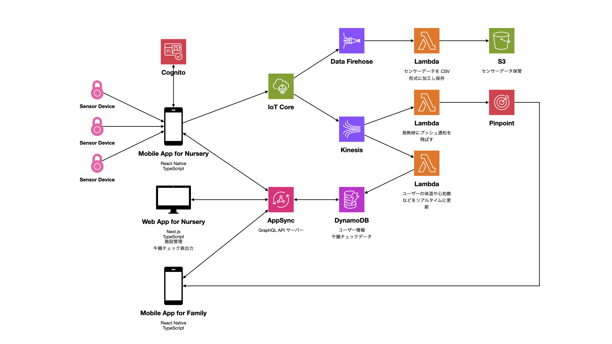

# エンジニア向け記事作成にあたっての質問と回答

## 1. touch&care では何を意識して制作しているか教えてください。

シンプルな設計です。

エンジニアはよく、いわゆる「僕の考える最高のアーキテクチャー」をやりがちですが、そういうのは書いた本人はわかってもほかのエンジニアは理解に苦しむことがよくあります。後から入ってきたエンジニアがドキュメントなしにソースコードを読むことができるシンプルで素直な設計が大事だと思っているので私はそれを常に意識しています。

(筆者注: 私が設計したものではないので一般論として語っています。)

## 2. エンジニアとしてどんな専門性を活かして、icucoのどんなサービスに貢献しているか教えてください。

私の専門は TypeScript, Node.js, React, GraphQL, AWS で、 icuco の技術スタックとばっちりハマっており、 icuco のフロントエンド、バックエンド、インフラストラクチャーすべてにおいて一人で技術を掌握できているため改修依頼やバグ対応に迅速かつ効率的に対応することで貢献できていると思います。

(筆者注: ちょっと質問が漠然としているか。)

## 3. icucoでしかできない設計やソフト構築で魅力的部分を教えてください。

IoT デバイスと連携したソフトウェアを開発できるので、 Bluetooth や IoT まわりの知見が得られることが魅力的だと思います。

## 4. 子供を見守る装置だからこそのこだわっている部分を教えてください。

センサーデータをローカル (iOS デバイスにインストールされた保育所アプリ内) で処理しているのでインターネットを経由するのに比べて遅延が発生しにくく、これによって寝姿勢や体調異常がリアルタイムに画面上に反映されるのがこだわりです。

## 5. icucoでのやりがいを教えてください。

フロントエンド、バックエンド、インフラストラクチャー、その他システム全般ついてすべてを一手に任せていただいていることがやりがいに感じています。

## 6. サーバレスでIoTを繋いだ理由を教えてください。

icuco がサーバーレスアーキテクチャーを採用した理由は以下です。

1. EC2 のような仮想マシンの管理が不要になり、 Lambda であればビジネスの中核となるソフトウェアの開発に専念できる。
2. Lambda は負荷が高まっても全自動でスケールアウトしてくれるので基本的に落ちることがない。
3. EC2 のような仮想マシンは起動しっぱなしになるので課金が高額になりがちだが、 Lambda はコードの実行にかかった時間数だけの課金になるので安くなることが多い。

(筆者注: 「サーバーレスアーキテクチャー」とは従来から一般的だった EC2 などの仮想マシンやオンプレミス (物理) サーバーの代わりに Lambda などのプログラム (関数) 実行サービス (クラウドコンピューティングサービス) を使うことを指します。「サーバレスでIoTを繋ぐ」という文言だとちょっと微妙かもです。)

## 7. 6 をしたことで得られた成果、利点を教えてください。

(筆者注: 上記の回答と同じ)

## 8. 6 を行うことで発生したトラブルや問題、どのように解決したか教えてください。

とくにありません。過負荷時でも落ちることなく、課金も安く済んでいます。

## 9. AWSの何の機能をIoTデバイスに使用しているか教えてください。また、理由についても教えてください。

icuco のアーキテクチャー図は以下のとおりです。

センサーデバイスが取得した体動や心拍数、体温などの計測データは Bluetooth Low Energy (BLE) 通信によって iOS デバイス (iPhone, iPad など) 上にインストールされた保育所用 iOS アプリケーション (以下「保育所アプリ」) に送信されます。保育所アプリでは受信したセンサーデータを元に午睡中の各幼児の寝姿勢の表示、うつ伏せ寝や無呼吸の警告を行います。保育士はそれらを助けに実際の寝姿勢や体調などを確定させます。それらの午睡データや幼児の情報などは AppSync で構築された GraphQL API サーバーを通じて DynamoDB に格納されます。

保育所アプリは並行してセンサーデータを IoT Core に飛ばして、 Data Firehose と Kinesis にルーティングします。 Data Firehose からは Lambda を発火させ、 Lambda 上でセンサーデータを CSV 形式に加工して S3 に保存します。 Kinesis では 2 つの Lambda をトリガー発火させ、 1 つ目はセンサーデータ上で幼児の発熱を検知したときに Pinpoint を呼び出して保護者用 iOS アプリケーション (以下「保護者アプリ」) にプッシュ通知を飛ばします。 2 つ目はセンサーデータから体温や心拍数などのデータを抜き出して DynamoDB をリアルタイムに更新し続けます。そのデータは保護者アプリから参照することができます。

保育所用ウェブアプリケーション (以下「保育所ウェブアプリ」) では AppSync を経由して DynamoDB に蓄積された幼児の情報の管理や午睡チェック表の出力が可能です。

(筆者注: この質問文「IoT デバイスに使用している AWS の機能」を厳密に解釈すると「アーキテクチャー図の IoT Core 以降の矢印」になるかと思いますが、意訳した適切な質問文は「インフラストラクチャーの構成を教えてください」だと思われます。)

(筆者注: icuco-book と icuco-eyes は Azure を採用しており、ゆくゆくは icuco-touch&care についても上記の AWS の既存システムはすべて廃止され Azure 上でスクラッチから開発する予定となっています。なのでこれを記事で取り上げるのは微妙かもしれません。)

## 10. 9 を行うことで得られた成果、使用する利点を教えてください。

センサーデータはデータ量こそ少ないものの飛んでくる頻度が数百ミリ秒単位と凄まじく、利用者が増えると莫大な量になるのですが、 AWS が用意してくれている IoT 関連のサービスを使うことでよしなに処理してくれるので落ちることなく捌けています。

## 11. 9 を使用することで発生したトラブルや問題、どのように解決したか教えてください。

過負荷時に Kinesis の処理が追いつかなくなり Lambda によるリアルタイムデータ更新処理が遅延するという不具合が出たことがありました。 Kinesis のシャード数を増やす (課金してスペックを増強する) ことでこの問題を回避しました。

DynamoDB には一括読み書き時の件数・容量制限があるのですが、これを考慮した実装になっていない箇所が多々あり、いくつものバグを生んでいました。 AWS 公式 DynamoDB SDK をラップしたライブラリを独自実装することでこれらの制限を回避しました。

## 12. 今後の成長に向けての展望を教えてください。

現在の icuco が設計開発されたのが <time>2019</time> 年で、基本設計は現在もそのまま踏襲しているためさすがに陳腐化してる部分が多々でてきました。

現在、最新のアーキテクチャーを使ってフルスクラッチで設計し直しています。今後何年経っても通用する堅牢かつシンプルな設計にできるようがんばります。
